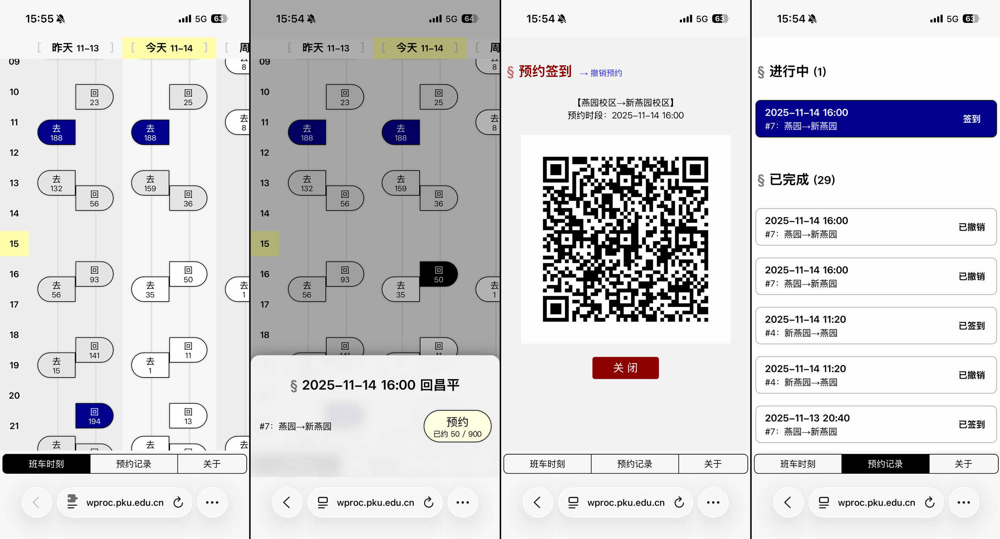

# Project Eutopia：

**班车预约 for Humans™**

班车预约系统增强脚本：一键约车，零键签到，一目了然，触手可及

## 功能特色

- 用**人类可读**的方式呈现班车时刻和预约记录
- 时间临近班车时（发车前 1~25 分钟）**自动展示详情**，可一键预约并展示二维码
- 时间临近已预约的班车时**自动展示二维码**
- 显示**超亮的二维码**，方便扫描（需要设备支持 HDR，比如 iPhone）
- 弱网环境**超快加载**，脚本仅 20KB，绕过原系统繁杂且低效的网络请求，且支持自动重试

## 安装方法

### PC / Mac 用户

首先在你的浏览器上安装 Tampermonkey（链接：[Chrome](https://chromewebstore.google.com/detail/tampermonkey/dhdgffkkebhmkfjojejmpbldmpobfkfo) / [Edge](https://microsoftedge.microsoft.com/addons/detail/%E7%AF%A1%E6%94%B9%E7%8C%B4/iikmkjmpaadaobahmlepeloendndfphd) / [Firefox](https://addons.mozilla.org/zh-CN/firefox/addon/tampermonkey/)）。

然后点击链接 [xmcp.ltd/pku-eutopia/eutopia.user.js](https://xmcp.ltd/pku-eutopia/eutopia.user.js)，将此脚本添加到 Tampermonkey 中。

### iOS 用户

首先使用 Safari 浏览器，**长按**链接 [xmcp.ltd/pku-eutopia/eutopia.user.js](https://xmcp.ltd/pku-eutopia/eutopia.user.js)，在弹出的菜单中选择 “下载链接文件”。

接下来在 AppStore 安装 [Userscripts](https://apps.apple.com/cn/app/userscripts/id1463298887)。进入应用后点击 “Change Userscripts Directory”，定位到下载文件所在的目录（默认是 “我的 iPhone” > “下载”，如果你愿意也可以把它移动到一个单独的目录）。

然后回到 Safari，访问班车预约系统 [wproc.pku.edu.cn](https://wproc.pku.edu.cn/)。点击地址栏旁边的插件图标，进入 “管理扩展” 菜单，启用 Userscripts 并授权访问当前域名。

### Android 用户

首先使用一个支持用户脚本功能的浏览器，例如 Edge（安装 [Tampermonkey](https://microsoftedge.microsoft.com/addons/detail/%E7%AF%A1%E6%94%B9%E7%8C%B4/iikmkjmpaadaobahmlepeloendndfphd)）和 Firefox（安装 [Tampermonkey](https://addons.mozilla.org/zh-CN/firefox/addon/tampermonkey/)）。

安装完成后，点击链接 [xmcp.ltd/pku-eutopia/eutopia.user.js](https://xmcp.ltd/pku-eutopia/eutopia.user.js)，将此脚本添加到 Tampermonkey 中。

## 使用方法

安装完成后，每次访问班车预约系统主页，Eutopia 将自动置顶显示。点击页面底部的按钮可以切换页面或者隐藏 Eutopia 界面。

建议将班车预约系统网址 [wproc.pku.edu.cn/v2/site/index](https://wproc.pku.edu.cn/v2/site/index) 添加到浏览器书签或者主屏幕，并在浏览器中记住 IAAA 登录密码，以方便后续使用。

## 开放源代码

[xmcp/pku-eutopia](https://github.com/xmcp/pku-eutopia)，按 MIT 协议开源。