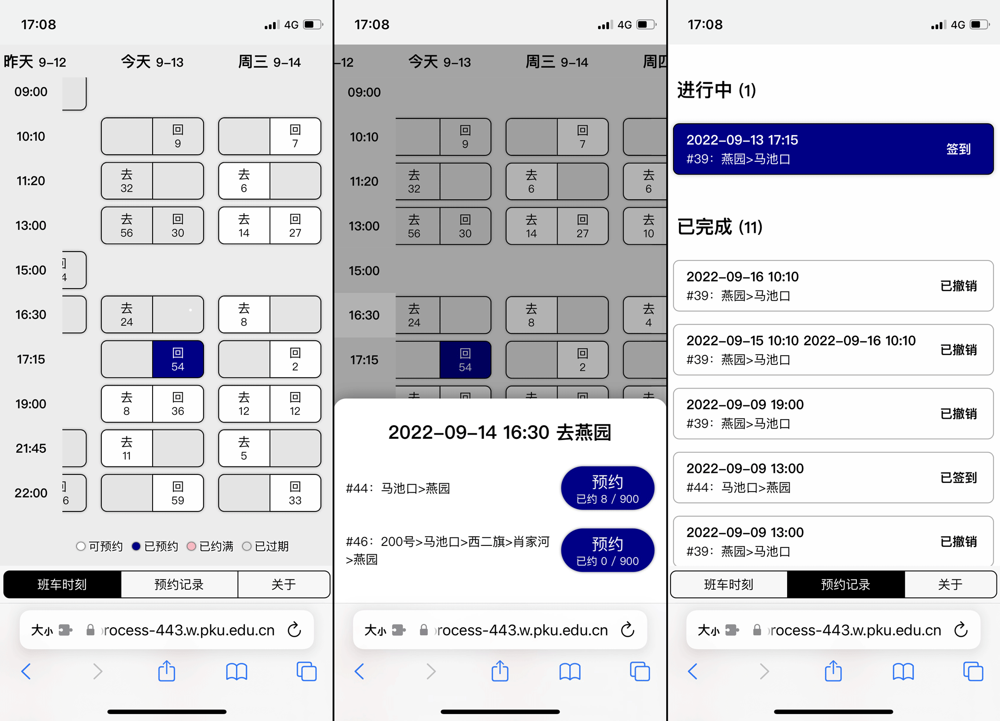

# Project Eutopia：

**班车预约 for Humans™**

班车预约系统重制版：快速约车，一键签到，一目了然，触手可及

## 通过用户脚本管理器安装（推荐）

首先安装一个用户脚本管理器。

PC 用户推荐使用 [Tampermonkey](https://www.tampermonkey.net/)。iOS / macOS 用户推荐使用 [Userscripts](https://apps.apple.com/cn/app/userscripts/id1463298887)，请参阅 [该项目的 README](https://github.com/quoid/userscripts#usage)。Android 用户推荐使用支持插件的浏览器（例如 Kiwi、Yandex Browser、Firefox Nightly）然后安装 Tampermonkey 等插件，请注意 [Firefox Nightly 需要经过复杂的设置才能安装 Tampermonkey](https://enux.pl/article/en/2021-03-14/how-use-tampermonkey-firefox-mobile)。

然后将 [https://xmcp.ltd/pku-eutopia/eutopia.user.js](https://xmcp.ltd/pku-eutopia/eutopia.user.js) 添加到用户脚本管理器中，即安装完成。

安装完成后每次访问办事大厅主页，页面底部将自动出现相关功能的按钮。iOS / macOS 用户首次使用时可能需要在地址栏左侧的菜单中授权插件访问办事大厅域名。

## 通过 Bookmarklet 安装

右键 / 长按 / 拖拽此链接 →【[班车预约](javascript:el=document.createElement('script');el.charset='utf-8';el.src='https://xmcp.ltd/pku-eutopia/eutopia.user.js';void document.head.appendChild(el))】 ，将它添加到浏览器书签。

此后在办事大厅域名打开书签，即出现相关功能的按钮。请注意你需要先登录到办事大厅再点击书签。

## 开放源代码

[xmcp/pku-eutopia](https://github.com/xmcp/pku-eutopia)，按 MIT 协议开源。